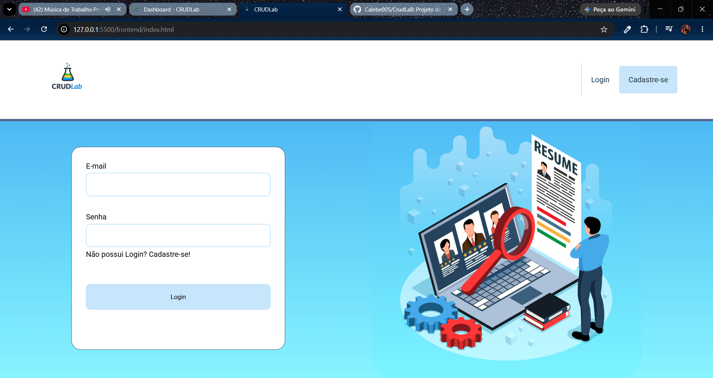
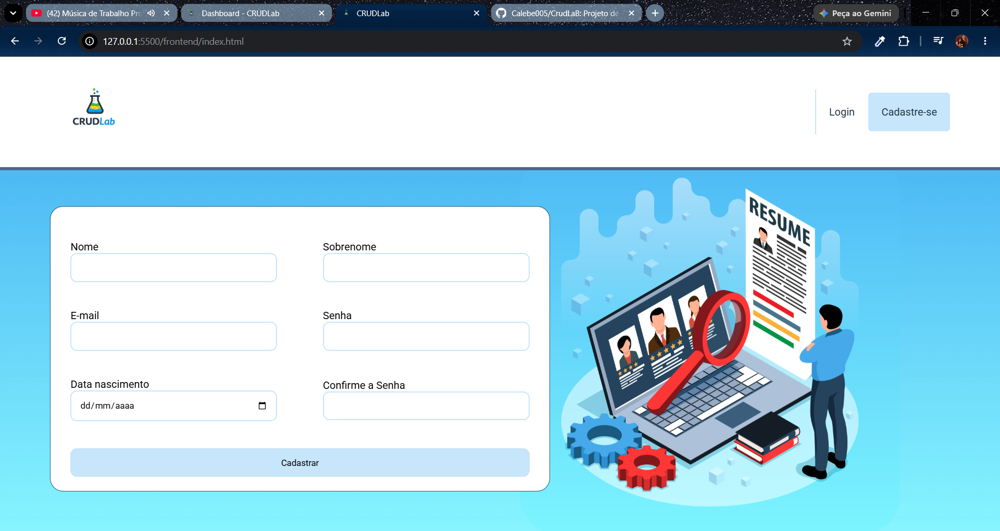
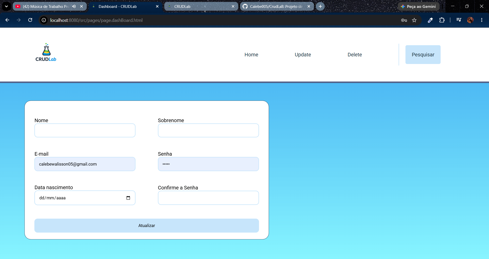
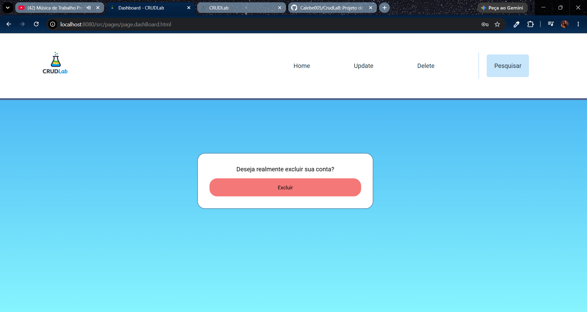
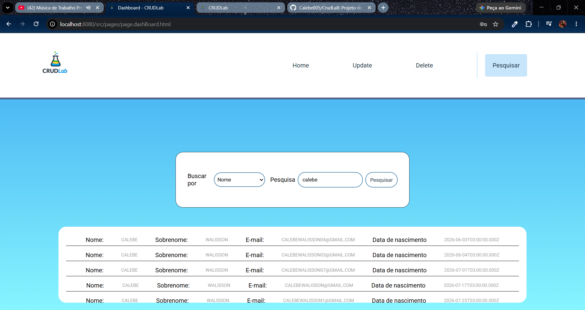

# 🧪 CRUDLab
Desenvolvido por Calebe Walisson  
📧 calebewalisson05@gmail.com

🧠 Objetivo educacional
Este projeto foi criado para fins de aprendizado e prática de integração entre front-end e back-end, servindo como base para estudos de APIs REST, autenticação e manipulação de dados.

Um sistema completo que une **Front-end** e **Back-end** em um único projeto, desenvolvido para testar e demonstrar o funcionamento de uma **API CRUD** (Create, Read, Update, Delete) com autenticação de usuário via login.

---

## 🚀 Sobre o projeto

O **CRUDLab** foi criado com o objetivo de servir como ambiente de aprendizado e experimentação para operações básicas de API.  
Após o login, o usuário pode realizar todas as operações do CRUD — criar, visualizar, atualizar e excluir dados — de forma simples e intuitiva.

---

## 🧩 Funcionalidades

- 🔐 **Login e autenticação** de usuários  
- 🧾 **Cadastro** de novos usuários  
- 🔍 **Pesquisa** de registros por nome, e-mail ou outros campos  
- ✏️ **Atualização** de dados existentes  
- 🗑️ **Exclusão** de contas com confirmação visual  
- 💡 Interface moderna e responsiva

---

## 🛠️ Tecnologias utilizadas

| Camada        | Tecnologias                  |
|---------------|------------------------------|
| **Front-end** | HTML5, CSS3, JavaScript      |
| **Back-end**  | Node.js, Express             |
| **Banco**     | MySQL (ou outro relacional)  |
| **Controle**  | Git e GitHub                 |

---

## 📂 Estrutura do projeto
CRUDLab/
├── backend/
│   ├── server.js
│   ├── routes/
│   ├── controllers/
│   └── models/
├── frontend/
│   ├── index.html
│   ├── dashboard.html
│   ├── scripts/
│   └── styles/
└── README.md

📸 Telas do sistema
Login

Cadastro

Update de casdastro

Confirmação de exclusão

Pesquisa de usuários

